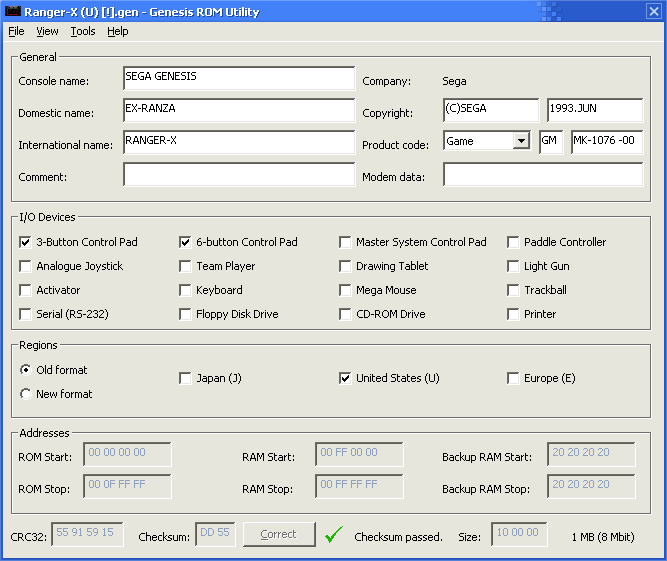

# genesis-rom-utility

An application for viewing and modifying the headers of ROM images for the Sega Genesis/Mega Drive and related consoles such as the 32X and Pico. It also converts between the bin and smd formats and fixes invalid checksums. Written in Visual Basic 6.

## Releases

Binary versions are available on the [Releases](https://github.com/jcfieldsdev/genesis-rom-utility/releases) page.

Some very old versions of Windows may require installing the [Visual Basic 6 runtime](https://github.com/jcfieldsdev/genesis-rom-utility/raw/master/vbrun60-setup.exe), but newer versions have these files preinstalled.

The program properly displays Japanese characters in game titles if you have the [MS Gothic](https://github.com/jcfieldsdev/genesis-rom-utility/raw/master/msgothic.zip) font installed.

## Guide

Open a ROM file by selecting "Open" from the *File* menu. By default, the file listing shows files with the .bin, .gen, .32x, and .smd extensions, but you can click the file filter dropdown box to list all files regardless of extension.

Once a file is opened, you can modify each field to whatever value you want. The appropriate number of padding spaces is automatically added to text fields when the file is saved.

The *Domestic name* and *International name* fields can contain Japanese characters. The program will try to determine this automatically, but you can manually choose how a field is displayed by selecting it and choosing "Display Field as English" or "Display Field as Japanese" from the *View* menu.

*Regions* has two different formats. Most ROMs use the old format (J for Japan, U for United States, and E for Europe). Some ROMs use the new format described in detail in [Genesis Technical Bulletin #31](https://mode5.net/32x-DDK/Bulletins/Gen-tech/Tech31-01.gif). You can specify the region format by selecting "Old format" or "New format."

If the ROM has an invalid checksum, you can correct it by pressing the "Correct" button next to the checksum or selecting "Fix Checksum" from the *Tools* menu and then saving the file.

You can convert the ROM to a different format by selecting "Convert to Bin" or "Convert to SMD" from the *Tools* menu and then saving the file.

You can apply an IPS patch to the ROM by selecting "Apply IPS Patch" from the *Tools* menu, choosing a patch file with the .ips extension, and then saving the file.

## Acknowledgments

Based on ["The Complete Documentation About the Genesis ROM Format"](https://github.com/jcfieldsdev/genesis-rom-utility/raw/master/genesis_rom.chm) by Felipe XnaK and ["ROM header reference"](https://plutiedev.com/rom-header) by Plutiedev.

CRC32 algorithm based on ["Calculating CRC32 with VB"](http://www.vbaccelerator.com/home/VB/Code/Libraries/CRC32/article.html) by Steve McMahon.

Uses [Genesis ROM icons](https://www.deviantart.com/alforata/art/Sega-Genesis-Rom-Icons-119800834) by [Alforata](https://www.deviantart.com/alforata).

## Authors

- J.C. Fields <jcfields@jcfields.dev>

## License

- [MIT license](https://opensource.org/licenses/mit-license.php)

## See also

- [Genesis ROM Converter](https://github.com/jcfieldsdev/genesis-rom-converter)—A command-line utility with similar functionality.
